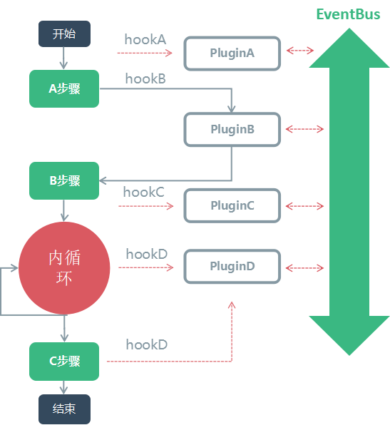

## pluggle
基于上下文的高性能高可靠轻量化插件化库

### 特点
1. **任务分片**  当在浏览器环境多个任务(异步注册时)执行超过12ms(预留4ms 左右 render)时会自动进行任务分片到不同的事件周期(或帧),不阻塞UI响应.
2. **隔离**: 保证异常影响范围最小, A插件的错误不影响B插件, 插件间的通信与Host通信隔离.
3. **灵活**: 支持多种方法注册动作: 
    - 已触发注册:`onAlready/onAlreadySync`: 用于像ready等只触发一次的事件;
    - 异步并行： `emitAsyncParalle`: 用于并行执行插件Hook，性能更好;
    - 异步串行：`emitAsyncSeries`: 用于串行执行插件Hook, 用于插件间有数据或流程上的依赖;
    - 单次：`once/onceSync`: 触发后解绑;
    - 同/异步：`on/onSync`: 同步执行时该时该的插件可以马上获取数据变更， 异步时，有分片性能更好; 
    - 支持事件的优先级和分包加载;
    - 支持实现有序广播和拦截广播: 拦截广播主要用于事件Hook没有处理时， 有兜底的行为。比如关机事件， 当没有软件处理关机事件， 需要正常关机;
4. **中心式的事件分发**： 避免网状的信息流，过长的调用链引起的事件泥潭和缺陷定位复杂.
5. **可靠**:  有效代码函数测试覆盖率100%, 行覆盖率98%+.
6. **轻量**: 2kb gzipped.

## Usage
 
```
tnpm i plugge --save
```

```javascript
    import Pluggable from 'plugge'
    class Reader extends Pluggable{
      constructor(){
        super()
      }

      init(){
        this.emitAsyncSeries('init')
      }

      nextPage(){
        this.emit('nextPage')
      }
    }
    //注册默认或高优先级插件, 在实例前时注入
    Reader.registerDefaultPlugin(function(){
      this.on('init', function(){
        this.context = {pageIndex: 1, imgIndex: 1}
      })

      this.emit('inited')
    })

   //实例化后延迟注入, 用于一些低优先级或插件分包加载
    const reader = new Reader()
    reader.registerPlugin(function(){
      this.onSync('nextPage', function(){
        this.context.pageIndex += 1
      })
    })

```

### 通信

#### 插件间的通信
```javascript
await host.eventBus.emitAsyncParalle('pluginName.moduleName:eventName', params)
host.eventBus.emit('pluginA.play:click', params)
host.eventBus.emit('pluginB.space:press', params)

// 多事件注册, 逗号分开
host.eventBus.onSync('pluginA.play:click,pluginB.space:press,pluginName.moduleName:eventName', async params =>{/*do something*/})
// 接收器的优先级
host.eventBus.once('pluginA.play:click', async params =>{/*do something*/}, {priority: 1001})
```

#### 插件与Host通信

插件与Host通信直接在Host上广播事件或是用插件间的通信方法同步信息

```javascript
// 同样支持 多事件注册, 接收器的优先级的api
host.emit('Host:ready', params)
host.onAlready('Host:ready', params =>{/*do something*/}) 
```
#### 拦截广播和有序广播
pluggable内未实现广播的拦截, 但可以结合 `priority`, `context`很容易实现有序广播的插件.


### 插件结构流程图



### 测试覆盖率

除了Typscript 生成的函数外, 函数覆盖率100%, 行覆盖率99%以上
```
=============================== Coverage summary ===============================
Statements   : 92.59% ( 250/270 )
Branches     : 78.2% ( 104/133 )
Functions    : 95.77% ( 68/71 )
Lines        : 98.18% ( 216/220 )
================================================================================
```

### 测试用例

```shell
npm t
```

### Built With

- 腾讯视频漫画阅读器
- Glame(腾讯视频内部框架)

### 兼容性
支持所有浏览器和node版本, 但`Chrome 45`, `Safari 8`, `Node 4` 以下注意`polyfill`以下api.

```
Array.prototype.findIndex
generator (for async)
```

### API
>说明：   
`on`, `once`, `onAlready`均为非阻塞注册事件， 但下个动作无法立即获取事件回调中的改动。    
同步阻塞版本为：`onSync`, `onceSync`, `onAlreadySync`。
同步事件的优先级永远大于异步。

详情使用请查看源码`test`文件测试用例.

```typescript
import { ListenerDetail } from "./EventInfo";
export declare enum PluggableInnerEvent {
    PluggableReady = "PluggableReady",
    PluggableHookError = "PluggableHookError"
}
export default class Pluggable<Context> {
    static disableChunk: boolean;
    static defaultPlugins: Array<Function>;
    isNodeEnv: boolean;
    /**
     * 插件间的事件通信， 用于不适合放在Host的中的事件
     */
    eventBus: Pluggable<any>;
    context: Context;
    /**
     * 注册默认的插件，在实例化前调用
     */
    static registerDefaultPlugin(plugins: any): void;
    /**
     *Creates an instance of Pluggable.
     * @param {boolean} [isPure=false] 纯净的实例不会生成eventBus, 不会注册默认插件，只提供基础的发布订阅能力
     * @memberof Pluggable
     */
    constructor(isPure?: boolean);
    /**
     *注册插件
     */
    registerPlugin(plugin: Function | {
        install: (...args: any[]) => any;
    }, context?: any): any;
    /**
     * alias of registerPlugin
     *
     * @memberof Pluggable
     */
    use(...args: any[]): void;
    /**
     * 注册事件
     * @param {string} events 支持多事件， 用逗号隔开， 比如on('eventA,eventB', f)
     * @param {Function} callback
     * @memberof Pluggable
     */
    on(events: string, callback: Function, detail?: ListenerDetail): void;
    onSync(events: string, callback: Function, detail?: ListenerDetail): void;
    off(events: string, callback: Function): void;
    onAllEvent(callbak: Function): void;
    emit(event: string, ...args: any[]): Array<any>;
    /**
     *异步并行执行事件, onSync生效
     *
     * @param {*} event
     * @returns
     * @memberof Pluggable
     */
    emitAsyncParalle(event: string, ...args: any[]): Promise<[{}, {}, {}, {}, {}, {}, {}, {}, {}, {}]>;
    /**
     * 异步串行执行事件, , onSync生效
     *
     * @param {*} event
     * @memberof Pluggable
     */
    emitAsyncSeries(event: string, ...args: any[]): Promise<any>;
    once(event: string, callback: Function, detail?: ListenerDetail): void;
    onceSync(event: string, callback: Function, detail?: ListenerDetail): void;
    /**
     * 注册可能已触发的事件， 用于Ready, beforeReady等只触发一次的事件Hook
     *
     * @param {string} event
     * @param {*} callback
     * @memberof Pluggable
     */
    onAlready(event: string, callback: Function, detail?: ListenerDetail): void;
    onAlreadySync(event: string, callback: Function, detail?: ListenerDetail): void;
    destroy(): void;
}

```

